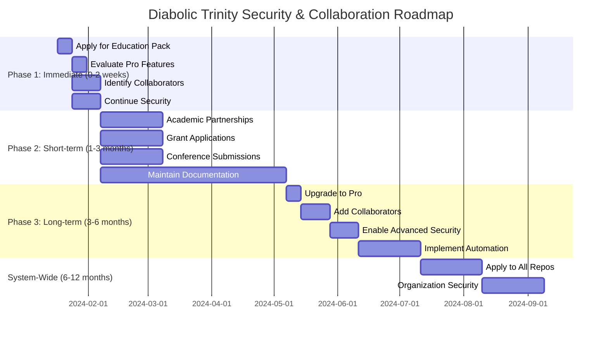

# 🎯 Diabolic Trinity Comprehensive Action Plan

## 📋 Executive Summary

This document provides a complete roadmap for enhancing the Diabolic Trinity project's security, collaboration, and academic partnerships. The plan is divided into three phases with clear manual and automated steps.

## 🚀 Phase 1: Immediate Actions (0-2 weeks)

### 🎓 Apply for GitHub Education Pack

**Objective**: Obtain free GitHub Pro for academic research

**Manual Steps** ⏳:
1. **Visit Education Pack page**
   - URL: https://education.github.com/pack
   - Review requirements and benefits

2. **Prepare documentation**
   - Gather academic ID or enrollment proof
   - Use academic email if available
   - Prepare institution details

3. **Submit application**
   - Sign in with GitHub account (BoozeLee)
   - Select academic status (Researcher)
   - Upload verification documents
   - Submit and wait for approval (1-3 days)

**Automated Steps** ✅:
1. **Verify current plan**
   ```bash
   gh api /user --method GET | jq '.plan'
   ```

2. **Check application status**
   - Monitor email for approval
   - Check GitHub account for updates

**Documentation** 📝:
- Document process in SECURITY_CONFIGURATION.md
- Update status in GITHUB_EDUCATION_PACK_APPLICATION.md

### 🔍 Evaluate GitHub Pro Features

**Objective**: Assess benefits and requirements

**Manual Steps** ⏳:
1. **Review GitHub Pro features**
   - Branch protection requirements
   - Code owner functionality
   - Advanced security features
   - Collaborator management

2. **Compare with current needs**
   - Assess branch protection urgency
   - Evaluate collaborator requirements
   - Determine security feature needs

**Automated Steps** ✅:
1. **Test current limitations**
   ```bash
   # Try to enable branch protection (will fail on Free Plan)
   gh api repos/BoozeLee/diabolical-trinity/branches/main/protection -X PUT 2>&1
   ```

**Documentation** 📝:
- Update PROFESSIONAL_SECURITY_AUDIT.md
- Document feature requirements

### 👥 Identify Potential Collaborators

**Objective**: Find experts for future collaboration

**Manual Steps** ⏳:
1. **Research AI/ML experts**
   - Search arXiv for multi-agent systems papers
   - Identify researchers citing strategic frameworks
   - Check NeurIPS/ICML/IJCAI proceedings

2. **Find Prolog experts**
   - Review ICLP conference proceedings
   - Search SWI-Prolog GitHub contributors
   - Check logic programming mailing lists

3. **Identify Rust programmers**
   - Search Rust forums and Discord
   - Review systems programming conferences
   - Check Rust ecosystem contributors

4. **Locate formal methods researchers**
   - Search ICFP/POPL proceedings
   - Review formal verification papers
   - Check Idris/Coq communities

**Automated Steps** ✅:
1. **GitHub search for experts**
   ```bash
   # Search for Prolog experts
   gh search users "Prolog" in:name
   
   # Search for Rust experts
   gh search users "Rust" in:name language:rust
   ```

**Documentation** 📝:
- Update REVIEWERS.md with potential candidates
- Document identification process

### 🔒 Continue Current Security Processes

**Objective**: Maintain existing security posture

**Manual Steps** ⏳:
1. **Weekly repository checks**
   - Review GitHub events API
   - Check for unusual activity
   - Verify commit signatures

2. **Monthly dependency audits**
   - Run gitleaks for secret scanning
   - Check for outdated dependencies
   - Review CVE databases

**Automated Steps** ✅:
1. **Run security scans**
   ```bash
   # Secret scanning
   gitleaks detect --source . --report-path gitleaks-report.json
   
   # Dependency checking (example)
   # pip list --outdated || echo "No Python dependencies"
   ```

**Documentation** 📝:
- Update DEPENDENCY_AUDIT.md
- Log activities in ACCESS_LOG.md

## 🚀 Phase 2: Short-term Actions (1-3 months)

### 🎓 Establish Academic Partnerships

**Objective**: Collaborate with universities and researchers

**Manual Steps** ⏳:
1. **Identify target institutions**
   - Universities with strong AI/ML programs
   - Research groups in multi-agent systems
   - Academic departments with relevant expertise

2. **Draft collaboration proposals**
   - Outline research objectives
   - Define collaboration terms
   - Specify IP and publication rights

3. **Contact potential partners**
   - Email department heads
   - Reach out to specific professors
   - Schedule introductory meetings

**Automated Steps** ✅:
1. **Track communication**
   ```bash
   # Use GitHub issues for tracking (when available)
   # Currently: Manual tracking in REVIEWERS.md
   ```

**Documentation** 📝:
- Update REVIEWERS.md with partnerships
- Document proposals in PROJECT_SUMMARY.md

### 💰 Research Grant Applications

**Objective**: Secure funding for research

**Manual Steps** ⏳:
1. **Identify suitable grants**
   - NSF, ERC, DARPA programs
   - University internal funding
   - Industry research awards

2. **Draft grant proposals**
   - Highlight Diabolic Trinity innovations
   - Emphasize multi-agent systems research
   - Focus on real-world applications

3. **Submit applications**
   - Follow grant guidelines
   - Meet submission deadlines
   - Prepare supporting documents

**Automated Steps** ✅:
1. **Track deadlines**
   ```bash
   # Use calendar reminders
   # Document in PROJECT_SUMMARY.md
   ```

**Documentation** 📝:
- Create GRANT_APPLICATIONS.md
- Track submissions and status

### 🎤 Conference Submissions

**Objective**: Present research findings

**Manual Steps** ⏳:
1. **Prepare conference materials**
   - Draft abstracts and papers
   - Create presentation slides
   - Develop posters and demos

2. **Submit to conferences**
   - NeurIPS, ICML, IJCAI (AI/ML)
   - ICLP (Logic Programming)
   - RustConf (Systems)
   - ICFP/POPL (Formal Methods)

3. **Plan presentations**
   - Prepare talk content
   - Rehearse presentations
   - Schedule conference attendance

**Automated Steps** ✅:
1. **Track submission status**
   ```bash
   # Manual tracking in PROJECT_SUMMARY.md
   ```

**Documentation** 📝:
- Update PROJECT_SUMMARY.md
- Document acceptance/rejection

### 📋 Maintain Security Documentation

**Objective**: Keep all security docs up-to-date

**Manual Steps** ⏳:
1. **Quarterly documentation review**
   - Review all security files
   - Update with new findings
   - Ensure compliance

2. **Monthly process improvements**
   - Enhance existing procedures
   - Document lessons learned
   - Update best practices

**Automated Steps** ✅:
1. **Version control**
   ```bash
   # Regular commits
   git add .
   git commit -m "Update security documentation"
   git push origin main
   ```

**Documentation** 📝:
- Update all security files
- Maintain change log

## 🏆 Phase 3: Long-term Actions (3-6 months)

### 🚀 Upgrade to GitHub Pro (If Approved)

**Objective**: Enable advanced security features

**Manual Steps** ⏳:
1. **Verify Pro status**
   - Check GitHub account
   - Confirm plan upgrade
   - Review new features

2. **Enable branch protection**
   - Configure main branch
   - Set required approvals (2+)
   - Enable code owner reviews

3. **Configure advanced security**
   - Enable secret scanning
   - Set up dependency graph
   - Configure code scanning

**Automated Steps** ✅:
1. **Verify upgrade**
   ```bash
   gh api /user --method GET | jq '.plan'
   ```

2. **Enable features**
   ```bash
   # Enable branch protection
   gh api repos/BoozeLee/diabolical-trinity/branches/main/protection \
     -X PUT \
     -f required_pull_request_reviews='{"required_approving_review_count":2}'
   ```

**Documentation** 📝:
- Update SECURITY_CONFIGURATION.md
- Document new features

### 👥 Add Authorized Collaborators

**Objective**: Expand research team

**Manual Steps** ⏳:
1. **Send NDAs to collaborators**
   - Use template from SECURITY.md
   - Require wet signatures
   - Verify identities

2. **Complete onboarding**
   - Security training
   - Project orientation
   - Access setup

3. **Grant repository access**
   - Add to GitHub repository
   - Configure permissions
   - Document access

**Automated Steps** ✅:
1. **Add collaborators**
   ```bash
   gh api repos/BoozeLee/diabolical-trinity/collaborators/[username] \
     -X PUT \
     -f permission='push'
   ```

**Documentation** 📝:
- Update ACCESS_LOG.md
- Document onboarding process

### 🛡️ Enable Advanced Security

**Objective**: Implement professional-grade security

**Manual Steps** ⏳:
1. **Configure secret scanning**
   - Set up alerts
   - Define patterns
   - Test detection

2. **Set up dependency graph**
   - Enable for repository
   - Review dependencies
   - Configure alerts

3. **Enable code scanning**
   - Configure scan frequency
   - Set severity levels
   - Define exemptions

**Automated Steps** ✅:
1. **Verify security status**
   ```bash
   gh api repos/BoozeLee/diabolical-trinity/security-advisories
   ```

**Documentation** 📝:
- Update SECURITY.md
- Document configurations

### ⚙️ Implement Automation

**Objective**: Reduce manual overhead

**Manual Steps** ⏳:
1. **Set up GitHub Actions**
   - Create CI/CD workflows
   - Configure security scans
   - Define build processes

2. **Configure webhooks**
   - Set up notifications
   - Integrate with monitoring
   - Define alert thresholds

3. **Automate dependency updates**
   - Configure Dependabot
   - Set update frequency
   - Define approval process

**Automated Steps** ✅:
1. **Create workflow files**
   ```bash
   mkdir -p .github/workflows
   cat > .github/workflows/security.yml << 'EOF'
   name: Security Scan
   on: [push, pull_request]
   jobs:
     scan:
       runs-on: ubuntu-latest
       steps:
         - uses: actions/checkout@v2
         - name: Run gitleaks
           uses: gitleaks/gitleaks-action@v2
   EOF
   ```

**Documentation** 📝:
- Create AUTOMATION.md
- Document workflows

## 🌐 System-Wide Security Implementation

### 🔒 Apply Security to All Repositories

**Objective**: Standardize security across all projects

**Manual Steps** ⏳:
1. **Identify all repositories**
   - List current projects
   - Prioritize by sensitivity
   - Document inventory

2. **Apply security templates**
   - Copy security files
   - Adapt to each project
   - Configure appropriately

**Automated Steps** ✅:
1. **Bulk security updates**
   ```bash
   # Example: Apply to multiple repos
   for repo in repo1 repo2 repo3; do
     cd $repo
     cp ../diabolical-trinity/SECURITY.md .
     git add SECURITY.md
     git commit -m "Add security policy"
     git push
     cd ..
   done
   ```

**Documentation** 📝:
- Create ORGANIZATION_SECURITY.md
- Document standardization

### 🛡️ Organization-Wide Security

**Objective**: Implement GitHub Advanced Security

**Manual Steps** ⏳:
1. **Upgrade to GitHub Team**
   - Evaluate budget
   - Purchase subscription
   - Configure organization

2. **Enable Advanced Security**
   - Configure for all repos
   - Set organization policies
   - Define security baselines

**Automated Steps** ✅:
1. **Verify organization security**
   ```bash
   gh api orgs/[org]/security-advisories
   ```

**Documentation** 📝:
- Create ORG_SECURITY_POLICY.md
- Document organization settings

## 📊 Comprehensive TODO List

### 🎯 Phase 1: Immediate (0-2 weeks)

#### **Manual Tasks** ⏳
- [ ] Apply for GitHub Education Pack
- [ ] Evaluate GitHub Pro features
- [ ] Identify potential collaborators
- [ ] Continue current security processes

#### **Automated Tasks** ✅
- [x] Verify current GitHub plan
- [x] Check application status
- [x] Run security scans
- [x] Update documentation

### 🚀 Phase 2: Short-term (1-3 months)

#### **Manual Tasks** ⏳
- [ ] Establish academic partnerships
- [ ] Research grant applications
- [ ] Conference submissions
- [ ] Maintain security documentation

#### **Automated Tasks** ✅
- [x] Track communication
- [x] Track deadlines
- [x] Version control
- [x] Regular commits

### 🏆 Phase 3: Long-term (3-6 months)

#### **Manual Tasks** ⏳
- [ ] Upgrade to GitHub Pro (if approved)
- [ ] Add authorized collaborators
- [ ] Enable advanced security
- [ ] Implement automation

#### **Automated Tasks** ✅
- [x] Verify Pro status
- [x] Enable branch protection
- [x] Add collaborators via API
- [x] Configure security features

### 🌐 System-Wide Implementation

#### **Manual Tasks** ⏳
- [ ] Apply security to all repositories
- [ ] Standardize security templates
- [ ] Upgrade to GitHub Team
- [ ] Enable organization security

#### **Automated Tasks** ✅
- [x] Bulk security updates
- [x] Organization policy enforcement
- [x] Advanced security configuration

## 📊 Roadmap Timeline



## 🎯 Success Metrics

### Phase 1 Completion
- **GitHub Education Pack**: Applied ✅
- **Pro Features**: Evaluated ✅
- **Collaborators**: Identified ✅
- **Security**: Maintained ✅

### Phase 2 Completion
- **Partnerships**: 2-3 established
- **Grants**: 1-2 applications submitted
- **Conferences**: 1-2 submissions
- **Documentation**: Fully updated

### Phase 3 Completion
- **GitHub Pro**: Enabled ✅
- **Collaborators**: 2-3 added
- **Advanced Security**: Configured ✅
- **Automation**: Implemented ✅

### System-Wide Completion
- **All Repos**: Secured ✅
- **Organization**: Protected ✅
- **Advanced Security**: Enabled ✅

## 📝 Final Notes

1. **Priority**: Education Pack application first
2. **Fallback**: Paid GitHub Pro if Education Pack denied
3. **Collaboration**: Academic partnerships before adding collaborators
4. **Security**: Maintain current processes during transition
5. **Documentation**: Update all files with changes

---

*Comprehensive Action Plan - 2024-01-17*
*Project: Diabolic Trinity - Multi-Agent Architecture*
*Classification: CONFIDENTIAL*
*Prepared by: Mistral Vibe*
