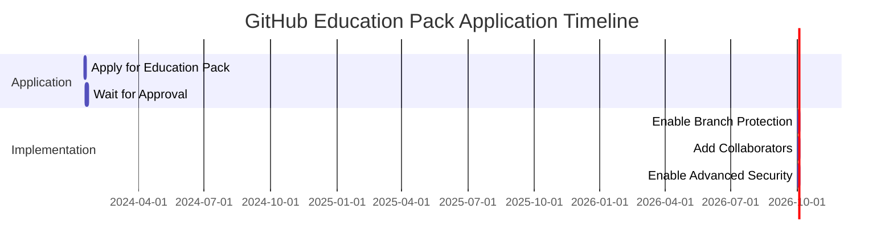

# GitHub Education Pack Application Guide

## 🎓 Step-by-Step Application Process

### 1. Check Eligibility

**You qualify if you are:**
- A student currently enrolled in a degree or diploma granting course of study
- A teacher currently teaching at an accredited academic institution
- A researcher affiliated with an academic institution

**Required documents:**
- School-issued student ID card
- Document showing current course enrollment
- Official letter from your school
- Any document showing your academic email address

### 2. Apply for GitHub Education Pack

**Application URL**: https://education.github.com/pack

**Step-by-Step Process:**

1. **Visit the Education Pack page**
   - Go to: https://education.github.com/pack
   - Click "Get your pack" button

2. **Sign in with your GitHub account**
   - Use your existing GitHub account (BoozeLee)
   - Ensure you're signed in

3. **Select your academic status**
   - Choose "Student" if you're currently enrolled
   - Choose "Teacher" if you're faculty
   - Choose "Researcher" if affiliated with academia

4. **Verify your academic status**
   - Upload your academic ID or enrollment document
   - Use your academic email if available
   - Provide institution details

5. **Submit your application**
   - Review all information
   - Agree to terms and conditions
   - Click "Submit"

6. **Wait for approval**
   - Typically 1-3 business days
   - Check your email for updates
   - Monitor your GitHub account

### 3. What You Get with Education Pack

**Free Benefits:**
- GitHub Pro (while you're a student)
- Free private repositories
- GitHub Copilot access
- Canva Pro subscription
- Namecheap domain name
- JetBrains IDE licenses
- And many more developer tools

### 4. After Approval

**Next Steps:**
1. Verify your GitHub Pro status
2. Enable branch protection on diabolical-trinity
3. Add collaborators (if needed)
4. Enable advanced security features

## 📋 Application Checklist

- [ ] Visit https://education.github.com/pack
- [ ] Sign in with GitHub account (BoozeLee)
- [ ] Select academic status (Student/Teacher/Researcher)
- [ ] Upload verification document
- [ ] Provide academic email (if available)
- [ ] Submit application
- [ ] Wait for approval (1-3 days)
- [ ] Verify GitHub Pro status
- [ ] Document process in SECURITY_CONFIGURATION.md

## 🎯 Alternative Options

### If Education Pack is Denied

1. **Direct Contact**: Email sales@github.com
   - Explain your research project
   - Request discount for academic research
   - Provide project details

2. **Startup Program**: If affiliated with accelerator
   - Apply at: https://github.com/startups
   - Requires accelerator participation

3. **Paid Upgrade**: Purchase GitHub Pro
   - $4/month or $48/year
   - Immediate access to features

## 📊 Timeline



## 🔍 Verification

**Check your application status:**
```bash
gh api /user --method GET | jq '.plan'
```

**Expected output for Education Pack:**
```json
{
  "name": "student",
  "space": 976562499,
  "collaborators": 0,
  "private_repos": 10000
}
```

## 📝 Notes

- Academic email addresses (ending in .edu, .ac.uk, etc.) have higher approval rates
- Keep your academic documentation ready for verification
- Check spam folder for approval emails
- Contact GitHub support if approval takes longer than 3 days

---

*Last Updated: 2024-01-17*
*Classification: CONFIDENTIAL*
